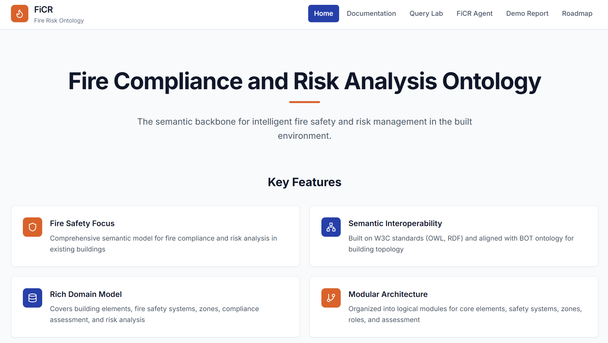
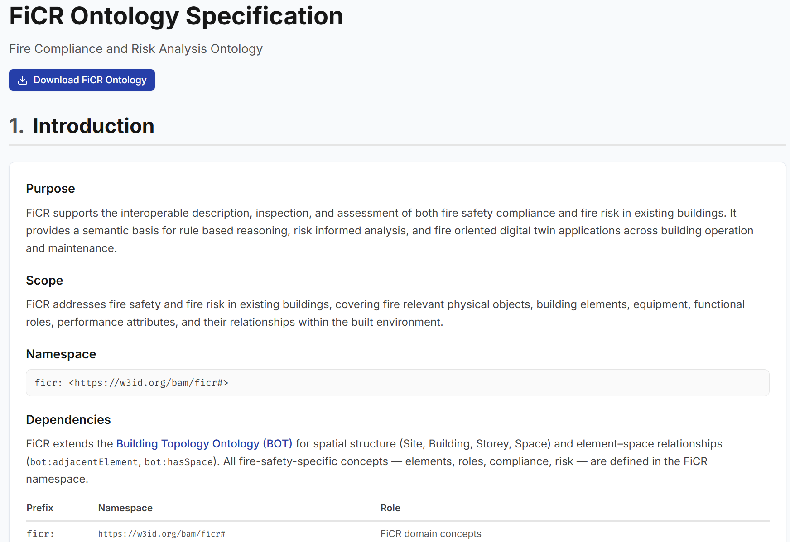
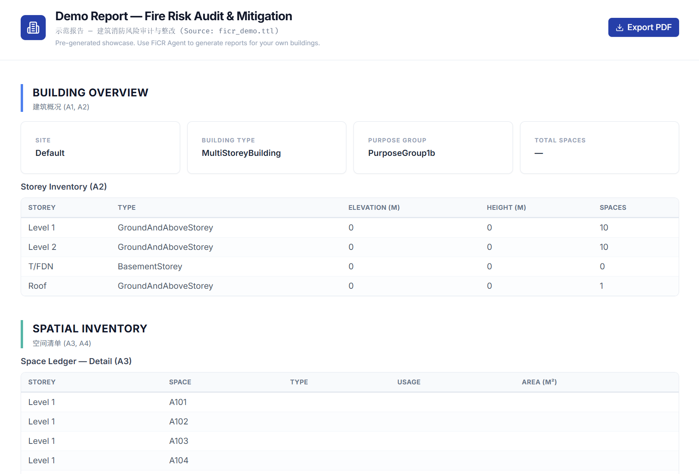
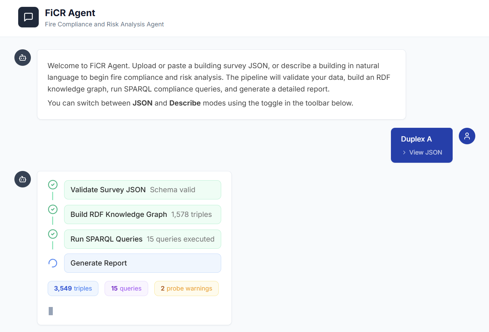
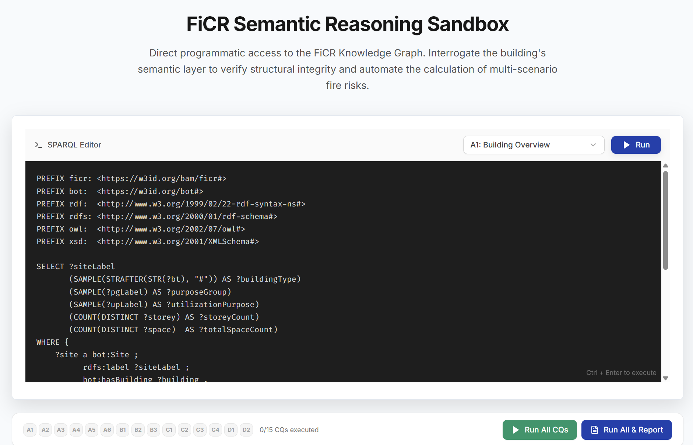
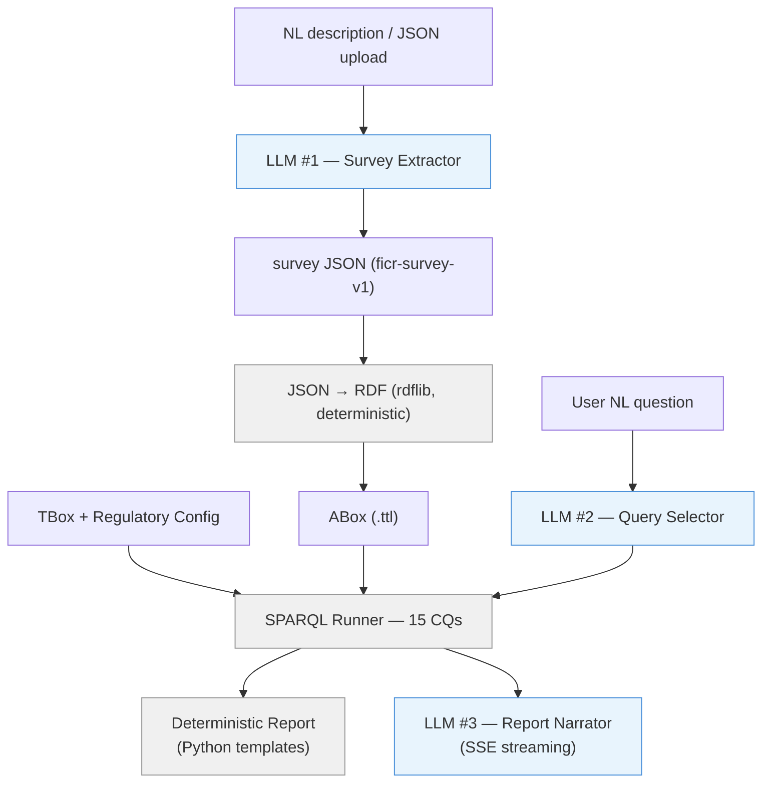

# FiCR Platform

**Fire Compliance and Risk Analysis Platform**

A semantic web application for building fire safety compliance checking and risk assessment, powered by an OWL ontology (FiCR), SPARQL-based competency queries, and LLM-assisted analysis.

Live demo: [https://RainGo111.github.io/FiCR/](https://RainGo111.github.io/FiCR/)



---

## Features

**Ontology Documentation** — Interactive browser for FiCR TBox classes and properties



**Compliance & Risk Report** — Pre-generated static report from ficr_demo.ttl (Duplex A), structured data tables + AI analysis



**FiCR Agent** — LLM-powered pipeline: NL/JSON input → RDF knowledge graph → SPARQL compliance queries → narrative report



**QueryLab** — SPARQL editor with 15 preset competency queries, live execution against GraphDB, deterministic report generation



---

## Architecture



Three LLM prompts under `backend/prompts/`:

| File | Role | Input / Output |
| --- | --- | --- |
| `1_survey_extractor.md` | LLM #1 | NL building description → `ficr-survey-v1` JSON |
| `2_query_selector.md` | LLM #2 | User NL question → CQ ID + optional FILTER |
| `3_report_narrator.md` | LLM #3 | SPARQL results → diagnostic analysis + recommendations |

---

## Project Structure

```text
ontology/                         # Canonical ontology source
  ficr_tbox.ttl                   # TBox (classes, properties, OWL axioms)
  ficr_demo.ttl                   # ABox — Duplex A instance data
  ficr_regulatory_config.ttl      # REI thresholds (PG 1b, ADB)
  ficr_risk_discovery_queries.sparql  # 15 SPARQL competency queries
  VERSION

backend/
  server.py                       # FastAPI + SSE streaming
  pipeline.py                     # 4-stage pipeline orchestrator
  ficr_json_to_rdf.py             # JSON → RDF (deterministic)
  ficr_sparql_runner.py           # SPARQL execution engine
  report_generator.py             # Deterministic Markdown report
  prompts/
    1_survey_extractor.md         # LLM #1 — NL → JSON
    2_query_selector.md           # LLM #2 — question → CQ
    3_report_narrator.md          # LLM #3 — results → narrative
  schemas/survey_schema.json      # ficr-survey-v1 JSON Schema
  references/                     # Synced ontology copies for backend
  sessions/                       # Pipeline intermediate outputs

src/
  pages/                          # React pages (Home, Documentation, QueryLab, Chatbot, Report, Roadmap)
  components/
    report/                       # Shared report components (ReportDataView, DataTable, HealthScoreCard, etc.)
    chatbot/                      # Chat UI (ChatMessage, ChatInput, PipelineProgress)
    documentation/                # Ontology browser components
  content/queries.ts              # 15 preset SPARQL queries
  data/demoReport.ts              # Static demo data for Demo Report page
  hooks/useSparqlQuery.ts         # GraphDB query hook

scripts/sync_ontology.py          # Sync ontology/ → public/ + backend/references/
```

---

## Getting Started

### Prerequisites

- Node.js (v16+), Python (3.10+)
- At least one LLM API key (Claude, OpenAI, Gemini, DeepSeek, or Zhipu GLM) for FiCR Agent
- GraphDB instance for QueryLab (optional — Demo Report and Documentation work without it)

### Setup

```bash
npm install
pip install -r backend/requirements.txt

# Configure environment
cp .env.example .env
# Edit .env — set GraphDB connection (optional, for QueryLab)

cp backend/.env.example backend/.env
# Edit backend/.env — add at least one LLM API key
```

### Run

```bash
# Terminal 1 — Frontend
npm run dev

# Terminal 2 — Backend
cd backend && uvicorn server:app --port 8000 --reload
```

Open <http://localhost:5173>

### After ontology changes

```bash
python scripts/sync_ontology.py
```

## License

Portal implementation: MIT. FiCR ontology retains its original license.
